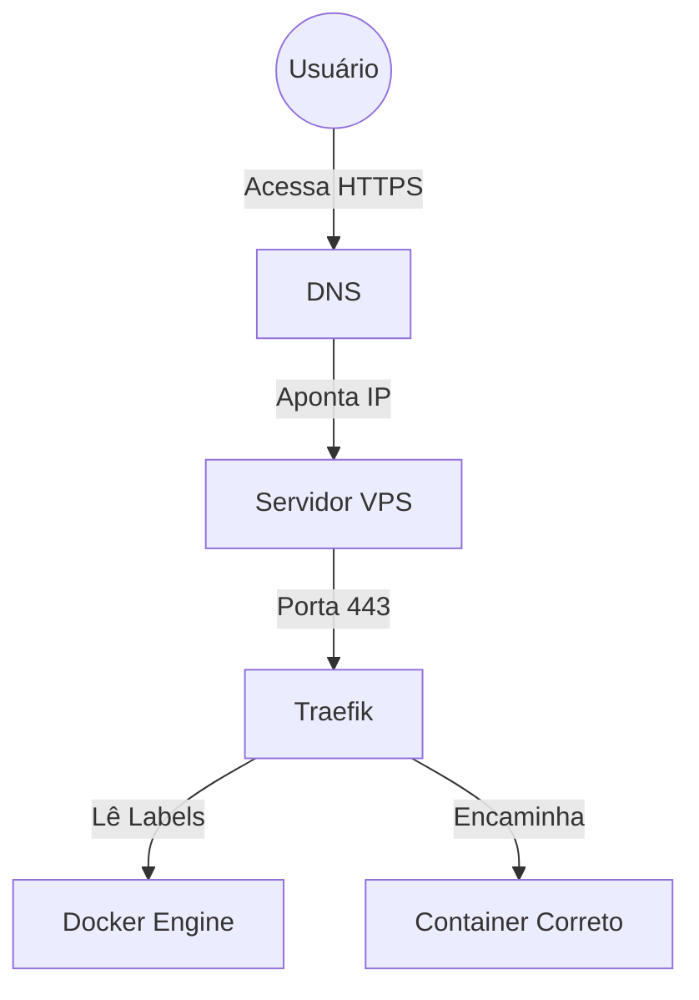

# 🚀 Deploy com Traefik + Docker (Mini Tutorial)

Este guia mostra **como configurar o Traefik do zero** para fazer proxy reverso de containers Docker usando **subdomínios**, com **HTTPS automático (Let's Encrypt)**.

---

### 🌐 Arquitetura Final

```text
Internet
   │
   ▼
DNS (*.seudominio.com)
   │
   ▼
IP do Servidor
   │
   ▼
Traefik (Proxy Reverso)
   │
   ├── 🔗 api.seudominio.com  ──▶  Backend (FastAPI)
   ├── 🔗 app.seudominio.com  ──▶  Frontend (React)
   └── 🔗 n8n.seudominio.com  ──▶  n8n
```

---

## 🛠 1. Liberar portas no servidor

O Traefik precisa que as portas padrões de tráfego web estejam abertas:

| Porta | Protocolo | Uso |
| :--- | :--- | :--- |
| **80** | HTTP | Redirecionamento automático |
| **443** | HTTPS | Tráfego seguro (SSL) |

> [!TIP]
> **Se usar UFW (Ubuntu):**
> ```bash
> sudo ufw allow 80
> sudo ufw allow 443
> sudo ufw reload
> ```
> 
> **Verificar status:**
> ```bash
> sudo ufw status
> ```

---

## 🌐 2. Criar rede Docker para o Traefik

Todos os containers que o Traefik vai acessar precisam estar na mesma rede externa para "se enxergarem".

```bash
docker network create proxy
```

---

## 📂 3. Estrutura recomendada

Organize seus arquivos de configuração da seguinte forma:

```text
/traefik
   ├── docker-compose.yml
   └── acme.json
```

---

## 🔑 4. Criar arquivo de certificado

O Let's Encrypt precisa de um arquivo específico para armazenar os certificados gerados. **Atenção às permissões!**

```bash
touch acme.json
chmod 600 acme.json
```

---

## 🐳 5. Docker Compose do Traefik

Crie o arquivo `docker-compose.yml` dentro da pasta `/traefik`:

```yaml
version: "3.8"

services:
  traefik:
    image: traefik:v3.0
    container_name: traefik
    restart: unless-stopped

    command:
      # Ativa o provedor Docker
      - "--providers.docker=true"
      - "--providers.docker.exposedbydefault=false"
      
      # Define os pontos de entrada (Ports)
      - "--entrypoints.web.address=:80"
      - "--entrypoints.websecure.address=:443"

      # Configuração do Let's Encrypt (SSL)
      - "--certificatesresolvers.letsencrypt.acme.httpchallenge=true"
      - "--certificatesresolvers.letsencrypt.acme.httpchallenge.entrypoint=web"
      - "--certificatesresolvers.letsencrypt.acme.email=seuemail@email.com"
      - "--certificatesresolvers.letsencrypt.acme.storage=/letsencrypt/acme.json"

    ports:
      - "80:80"
      - "443:443"

    volumes:
      - "/var/run/docker.sock:/var/run/docker.sock:ro"
      - "./acme.json:/letsencrypt/acme.json"

    networks:
      - proxy

networks:
  proxy:
    external: true
```

**Para iniciar o Traefik:**
```bash
docker compose up -d
```

---

## 🛰 6. Configurar DNS

No painel de gerenciamento do seu domínio (Cloudflare, GoDaddy, etc):

1. **Criar registro do tipo A**
   - **Nome (Name):** `*` (ou subdomínios específicos)
   - **Valor (Value):** `IP_DO_SERVIDOR`

> Isso permite que qualquer subdomínio (`api.`, `app.`, `teste.`) aponte automaticamente para o seu servidor.

---

## 🔌 7. Conectar um projeto ao Traefik

A mágica acontece via **Labels**. Veja um exemplo de um backend **FastAPI**:

```yaml
services:
  web:
    build: .
    restart: unless-stopped
    command: uvicorn app.main:app --host 0.0.0.0 --port 8000

    labels:
      - "traefik.enable=true"
      # Regras de Roteamento
      - "traefik.http.routers.api.rule=Host(`api.seudominio.com`)"
      - "traefik.http.routers.api.entrypoints=websecure"
      - "traefik.http.routers.api.tls.certresolver=letsencrypt"
      # Porta interna do container
      - "traefik.http.services.api.loadbalancer.server.port=8000"

    networks:
      - proxy

networks:
  proxy:
    external: true
```

**Subir projeto:**
```bash
docker compose up -d --build
```
> O backend estará disponível em: **`https://api.seudominio.com`**

---

## 🎨 8. Criar outro projeto em outra URL

Exemplo de um frontend **React** rodando com Nginx:

```yaml
services:
  frontend:
    image: nginx
    labels:
      - "traefik.enable=true"
      - "traefik.http.routers.front.rule=Host(`app.seudominio.com`)"
      - "traefik.http.routers.front.entrypoints=websecure"
      - "traefik.http.routers.front.tls.certresolver=letsencrypt"
      - "traefik.http.services.front.loadbalancer.server.port=80"
    networks:
      - proxy

networks:
  proxy:
    external: true
```
> Aplicação disponível em: **`https://app.seudominio.com`**

---

## 🔄 9. Fluxo Completo



---

## 📊 10. Comandos Úteis

**Ver containers rodando:**
```bash
docker ps
```

**Ver logs em tempo real (para debug):**
```bash
docker logs traefik -f
```

**Testar rota via terminal:**
```bash
curl -I https://api.seudominio.com
```

---

## 🏆 11. Vantagens do Traefik

*   ✅ **HTTPS Automático:** Gera e renova certificados sozinho.
*   ✅ **Zero Config:** Sem arquivos `.conf` complexos de Nginx.
*   ✅ **Auto-discovery:** Detecta novos containers instantaneamente.
*   ✅ **Cloud Native:** Feito sob medida para arquiteturas Docker e Microserviços.

---

## 🗺 12. Exemplo Final de Arquitetura

```text
Servidor (VPS)
   │
   └── Traefik
        ├── 🟢 api.financepowder.cloud  ──▶  FastAPI
        ├── 🟢 app.financepowder.cloud  ──▶  React
        ├── 🟢 n8n.financepowder.cloud  ──▶  n8n
        └── 🟢 ai.financepowder.cloud   ──▶  Ollama
```

---
**Dica:** Tudo é roteado apenas com **labels** no seu arquivo Docker Compose! 🚀
